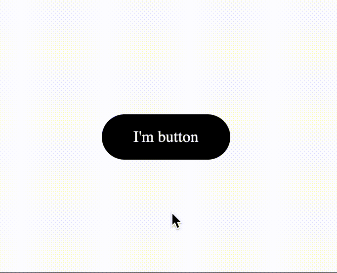

# MagneticJS
**MagneticJS** is a small vanilla javascript library that creates the effect of magnetizing elements to the mouse cursor.



To see how it works you should just download files and open **demo.html** in your loved browser.

## Basic usage

```js
    const magnetic = new Magnetic()
    magnetic.add({
        element: document.querySelector('.your-element')
    })
```

## Properties

| Property | Default | Accepts | Description
| ------ | ------ | ------ | ------ |
| element | - | HTMLElement | Required option that tells which element to make magnetic (*Please note, the element cannot be inline display property*)
| powerDistance | 50 | integer | How many pixels on the left, right, bottom, top are affected by the magnetic zone
| updateOnScroll | false | bool | If you assume that your element will be able to change its position depending on scrolling (for example you use the GreenSock ScrollTrigger library), set this option to **true**.
